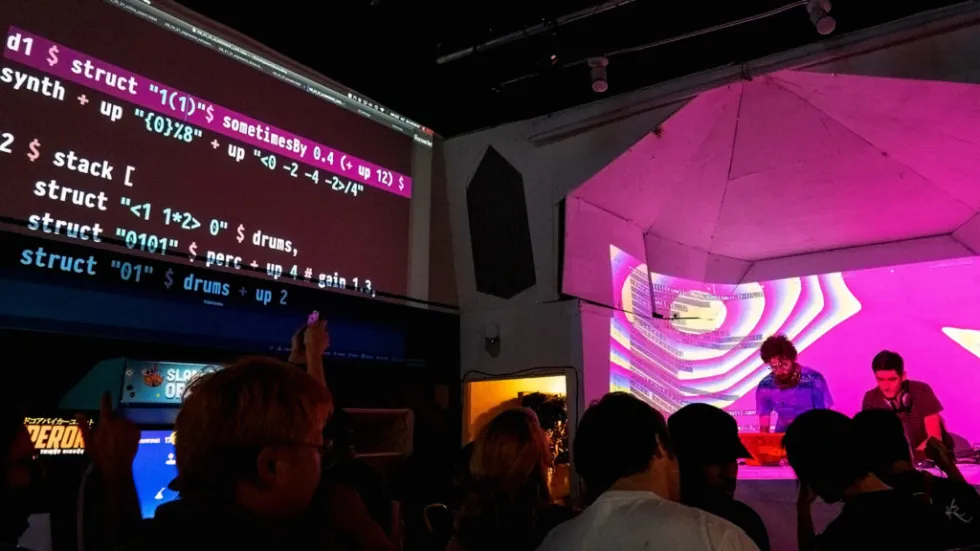

# 🌊 Algorave Tidal Haskell Guide

Welcome to my personal guide and learning log on **TidalCycles**, **SuperCollider**, and the art of live coding music in the world of **Algorave**. This repository is a curated collection of notes, examples, and cheat sheets written in Markdown to help me (and maybe you!) better understand the live coding ecosystem.

---

## 🎧 What is Algorave?

**Algorave** is a global movement where artists use live coding to create music for dance floors. The term comes from *algorithm* + *rave*. Instead of traditional DJing, performers write and modify code in real time, producing evolving, algorithmic soundscapes and rhythms.

It’s not just about sound—Algorave is also about the aesthetics of code. The source code itself is usually projected to the audience, turning the programming process into part of the performance.

  

---

## ⚡ Why TidalCycles + SuperCollider?

**TidalCycles (Tidal)** is a domain-specific language (DSL) for live coding music. It lets you describe complex musical patterns with minimal syntax using Haskell, a purely functional programming language.

**SuperCollider** is the powerful audio engine behind Tidal, responsible for sound synthesis and playback. Together, they offer:

- 🔁 **Pattern-centric thinking**: easily create polyrhythms, nested patterns, and time-based transformations.
- 🎛️ **Real-time control**: modify sounds live with minimal delay.
- 🎹 **Sound flexibility**: use custom samples or synthesis engines like SuperDirt.
- 🎼 **Mathematical musicality**: harness the expressive power of functional programming.
- 🧠 **Creative coding**: think about music in new, generative ways.

This combination is ideal for experimentation, improvisation, and the live coding stage.

---

## 📓 About This Project

This repository is my **learning journal**—a personal log of everything I’ve been exploring in the realm of Algorave, TidalCycles, and Haskell. It includes:

- 🧾 Cheat sheets for TidalCycles patterns, syntax, and functions.
- 💡 Comments and explanations in Markdown for deeper understanding.
- 🚀 Notes on setup, workflow, and useful tips for performance.
- 🧪 Experiments, sketches, and minimal live code templates.

---

## 💡 Who is this for?

While this guide is primarily for personal use, anyone interested in:

- Live coding music
- Functional programming in Haskell
- Creative sound design with SuperCollider
- Learning how to perform with code

...may find it helpful or inspiring.

---

## 📜 License

This work is licensed under a **Creative Commons Attribution-NonCommercial 4.0 International (CC BY-NC 4.0)** license.

---

## 🚧 Status

This is a **work in progress** and will evolve as I learn more. Contributions, suggestions, or feedback are always welcome via [issues](https://github.com/jproven/algorave-tidal-haskell-guide/issues).

---

Thanks for stopping by, and happy live coding! 💻🎶
